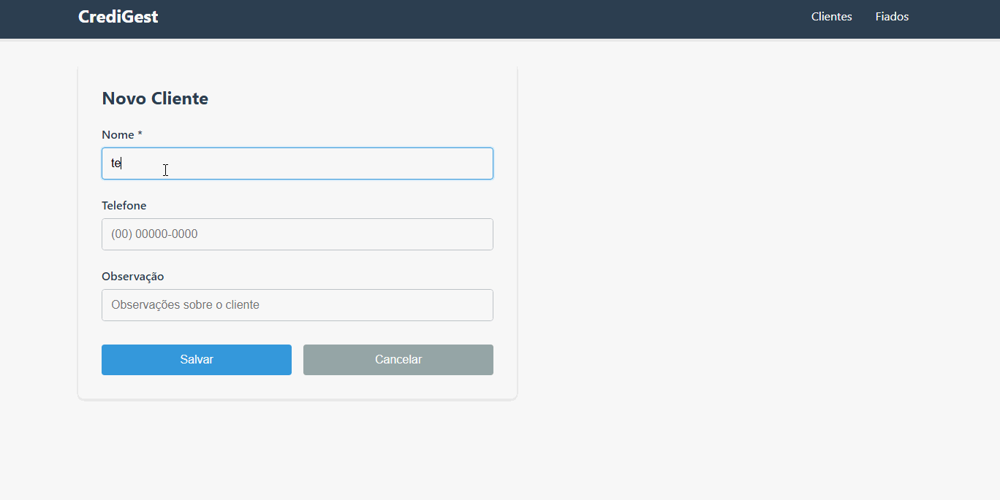

# 📊 CrediGest

### Sistema de gerenciamento de crédito (“fiado”) desenvolvido para atender um comércio local, com foco em controle de clientes, registro de vendas e organização de débitos de forma simples, rápida e confiável.

---

### 📌 Contextualização do Projeto

O CrediGest nasceu de uma necessidade real observada em um comércio local onde trabalhei anteriormente. Na época, o controle de vendas no “fiado” era feito de forma manual através de cadernos, o que gerava dificuldades como:

- Falta de organização dos débitos por cliente
- Dificuldade em acompanhar histórico de compras
- Risco de erros humanos e esquecimentos em anotações
- Ausência de uma visão clara de saldo de cada cliente

Diante disso, me foi solicitado o desenvolvimento e a integração de um sistema simples, porém eficiente, que pudesse centralizar essas informações e facilitar o gerenciamento financeiro do estabelecimento.

O resultado foi o CrediGest: uma aplicação web moderna voltada para controle de clientes e seus respectivos créditos/débitos, trazendo mais segurança, agilidade e transparência para o processo.

A aplicação foi configurada para execução local na máquina do estabelecimento utilizando Docker.

A inicialização do sistema é realizada por meio de scripts automatizados (.bat), que simplificam o processo de startup e melhoram a experiência de uso, permitindo a execução com um único clique.

---

### 🚀 Funcionalidades
- Cadastro de clientes
- Registro de vendas a prazo (fiado)
- Controle de saldo devedor e créditos por cliente
- Histórico de transações
- API REST para integração com frontend

---

### 🧱 Arquitetura do Sistema

O projeto foi estruturado como uma aplicação full stack separada em camadas:

- Backend: API REST desenvolvida em Java com Spring Boot
- Frontend: Interface web React.
- Banco de Dados: PostgreSQL em ambiente de produção e H2 para testes/desenvolvimento.
- Infraestrutura: Containerização com Docker e Docker Compose.

---

### 🐳 Docker e Infraestrutura

O sistema foi preparado para execução em ambiente containerizado, incluindo:

- Backend em container Spring Boot
- Frontend com build multi-stage (Node → Nginx)
- Banco de dados PostgreSQL via Docker Compose
- Uso de variáveis de ambiente (.env)
- Arquivo .env.example para configuração padrão
- Configuração de SPA no Nginx com fallback (try_files)
- Rede entre serviços via Docker

---

### 🔐 Boas Práticas Implementadas
- Separação entre ambientes (dev e produção)
- Uso de variáveis de ambiente para configuração sensível
- Configuração de CORS para integração local com frontend
- Estrutura organizada por camadas no backend
- Containerização completa do sistema
- Padronização de builds com Docker multi-stage
- Configuração adequada de fallback para SPA

---

### ⚙️ Tecnologias Utilizadas
- Java 21
- Spring Boot 4.0.3
- Spring Web
- Spring Data JPA
- H2 Database (testes)
- PostgreSQL (produção)
- Swagger / OpenAPI
- Docker & Docker Compose
- React
- Nginx

---

### 📦 Como Executar o Projeto
#### 🔧 Pré-requisitos
- Docker instalado
- Docker Compose instalado

### ▶️ Execução
- Substitua o nome do arquivo .env.generic para .env, e configure as credenciais do banco de dados.
- Executar o arquivo Run.bat com script docker automatizado para inicar (Windows).
- Executar o arquivo Stop.bat com stript docker automatizado para interromper (Windows).

#### Após isso, os serviços estarão disponíveis em:

- Frontend: http://localhost:3000
- Backend: http://localhost:8080
- Swagger: http://localhost:8080/swagger-ui.html

---

### 🧠 Aprendizados

#### Este projeto consolidou conhecimentos importantes em:

- Desenvolvimento full stack
- Arquitetura de APIs REST
- Integração frontend + backend
- Containerização com Docker
- Configuração de ambiente de produção
- Boas práticas de organização de sistemas reais
- Levantamento de requisitos
- Experiência real de desenvolvimento

---

### 🧩 Especificações Técnicas

- **Utilização de interfaces de contrato para operações de escrita, permitindo flexibilidade e extensibilidade na manipulação de dados.
Exemplo: OnCreate, OnUpdate, facilitando padronização de regras de negócio por operação.**

- **Implementação de requisições HTTP PATCH com abordagem diff-based, permitindo atualizações parciais e mais eficientes em:**

    - Fiados (débitos dos clientes)
    - Pagamentos
    - Itens associados às transações

- **O saldo do cliente NÃO é persistido no banco de dados, sendo calculado dinamicamente no backend a cada requisição baseado na fórmula:**
 
    - saldo = total_de_fiados - total_de_pagamentos

  - **Interpretação do saldo:**

    - Se o resultado for positivo, o cliente possui débito (fiado em aberto)
    - Se o resultado for negativo, o cliente possui crédito disponível
   
  - **Essa abordagem garante:**

    - Maior consistência dos dados
    - Eliminação de inconsistências por atualização manual de saldo
    - Fonte única de verdade baseada em transações
 
### 📌 Status do Projeto

✔️ Concluído (versão atual com containerização completa e ambiente de produção funcional).

# Demonstração do sistema

